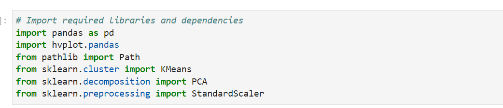
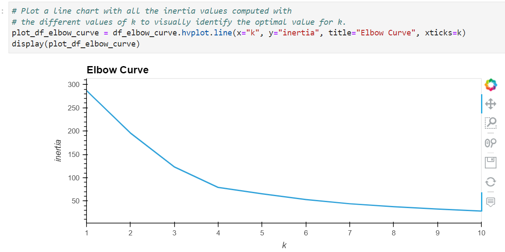
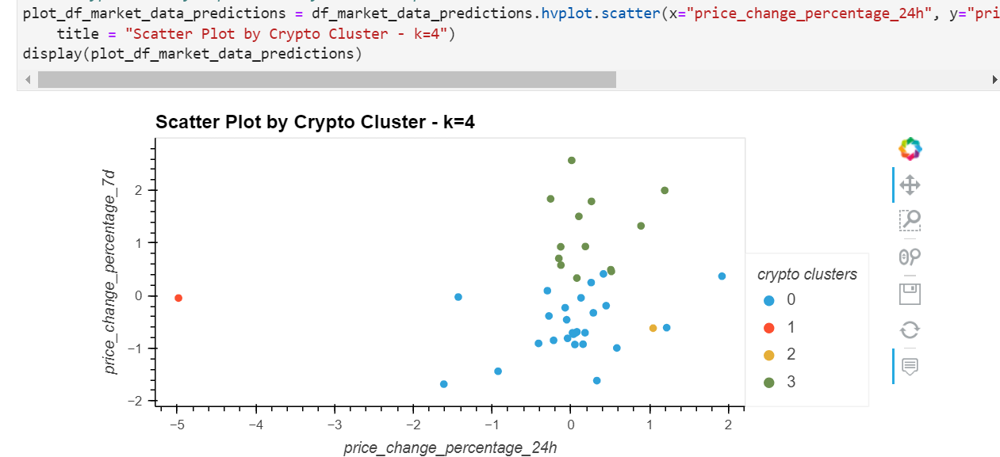
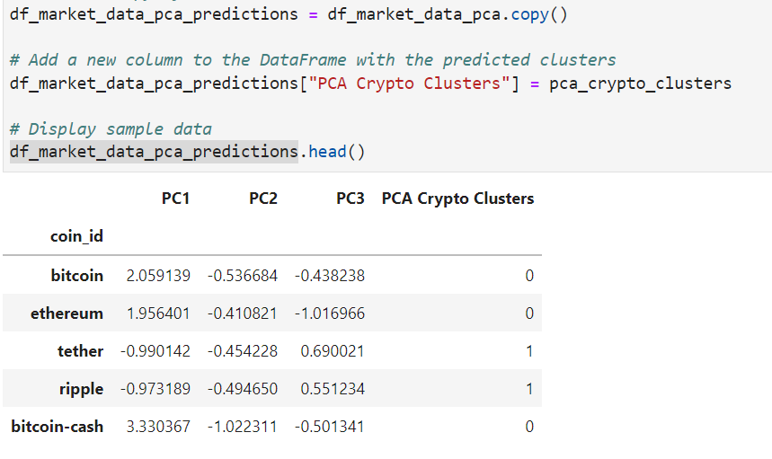
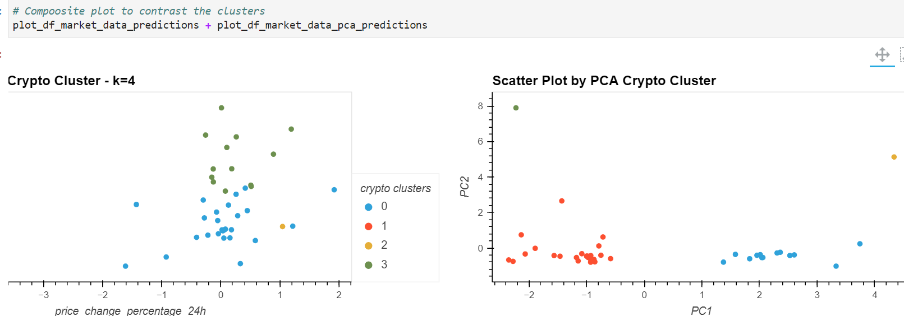

# Financial-Advisory-Crypto-Market
As an advisor in one of the top five financial advisory firms in the world, I wanted to propose a novel approach to assembling investment portfolios that are based on cryptocurrencies. Instead of basing my proposal on only returns and volatility, I wanted to include other factors that might impact the crypto market—leading to better performance for a crypto portfolio.

I have been asked by my company to create a prototype for submitting my crypto portfolio proposal to the company board of directors.

---

## Technologies
###### Resource 
- crypto_market_data.csv file 
-- http://localhost:8888/lab/tree/Resources/crypto_market_data.csv

   
###### Tools
- import pandas as pd
- import hvplot.pandas
- from pathlib import Path
- from sklearn.cluster import KMeans
- from sklearn.decomposition import PCA
- from sklearn.preprocessing import StandardScaler

---

## Installation Guide

Installation requirements for this project included Python and Panda Libraries, pathlib, HvPlot and sklearn

---

## Results

Final Analysis: 
 

Using clustering allowed me to visually analyze the crypto data to enhance the diversity of the portfolio based on the coin_id. Clustering the different coins into groups will show which coins that perform similarly and therefore choosing coins in different clusters to create a cyrpto portfolio along with volitility and retuns could really improve a portfolios diversity and performance.

## Contributors

#### Contact
zehra.vahidy@gmail.com
LinkedIn https://www.linkedin.com/in/zehra-vahidy-6025b820

---

## License

None

## Appendix
https://docs.github.com/en/get-started/writing-on-github/getting-started-with-writing-and-formatting-on-github/basic-writing-and-formatting-syntax#headings
